# Portfolio-

## Links
- [My Website](https://blaisetsh.netlify.app/)
- [Github](https://github.com/Blaise122/Portfolio-.git))

> ## Purpose
Portfolio websites are vital for devolpers working in the digital age. While as developers we can hand out business cards, a portfolio website provides a way for any developer in any industry to reach more clients on a global scale. It also provides a way for you to get creative with the information and intricate details you share about yourself and your work.

Furthermore, it is also an invaluable extension of a developer's and company's resume. It provides a convenient way for potential clients to view your work while also allowing you to expand on your skills and services. Prior to hiring a developer, a prospective employer will typically want to see samples of your work. So, whether you are looking for employment from a company or clients, you should probably have a portfolio website.

Thus, ultimate purpose of a portfolio website being to provide a mean for a developer to land more clients, whether as a freelance worker, clients for your agency or employment at a company.

> ## Functionality / Features
The goal was to build a proffolio website with a clean-cut professional feel and look. Visitors shouldn't have to search for information. Information is presented right up front and with clear direction to navigate to exactly the pages and information they seek.
With that in mind, focus was placed on design planning, graphic design, consistency of design and site navigation.

The following functionality / features were used to action this goal:
- Logo
- Menu / Navigation bar
- Heading and tagline
- Short blurb of text
- Images
- Call to action button
- Easily readable font
- Links to other pages
- Contact form
- Desktop, tablet and mobile responsiveness
- Socail media icons
- Paragraphs
- Consitant colors across all pages

> ## Sitemap
This is a display of the website's document structure and descriptions. This tool helps with user navigation.

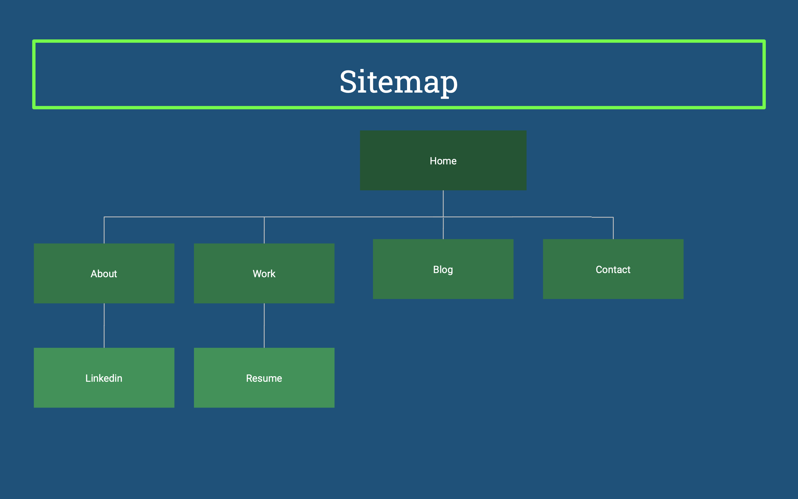

> ## Screenshots

Screenshots of the different website pages with their desktop, tablet and mobile responsiveness.

### Home page
---

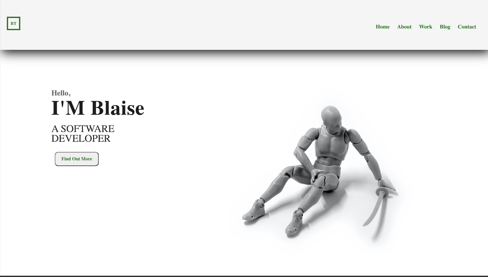   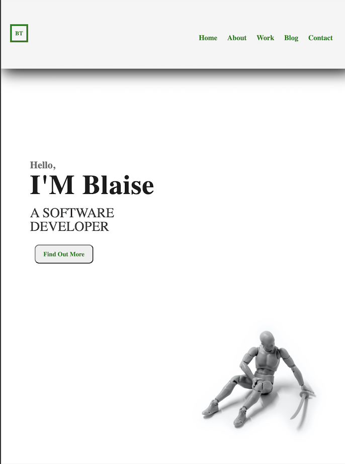  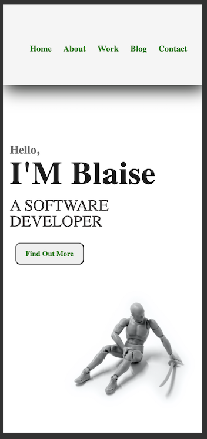

### About page
---

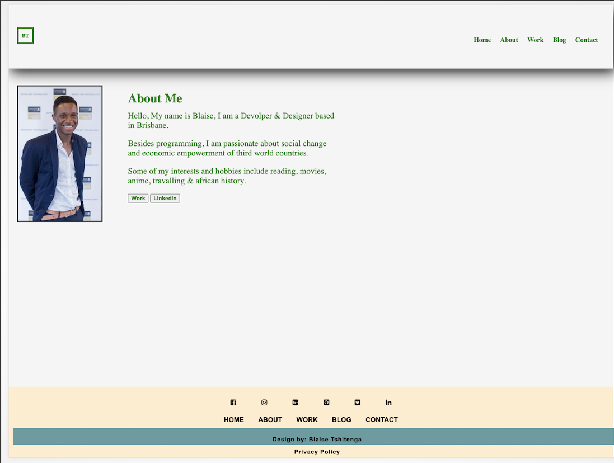  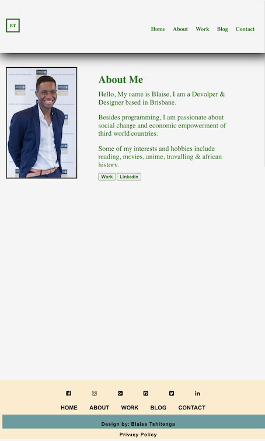  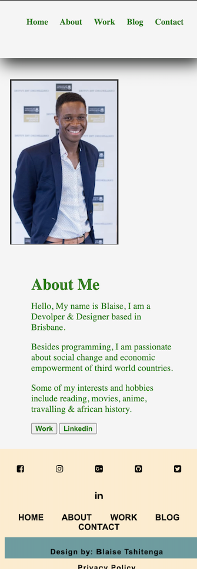

### Work page
---

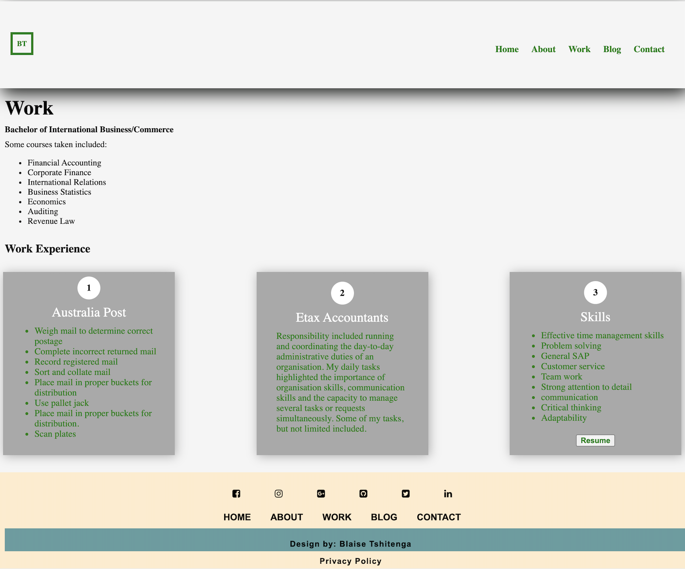  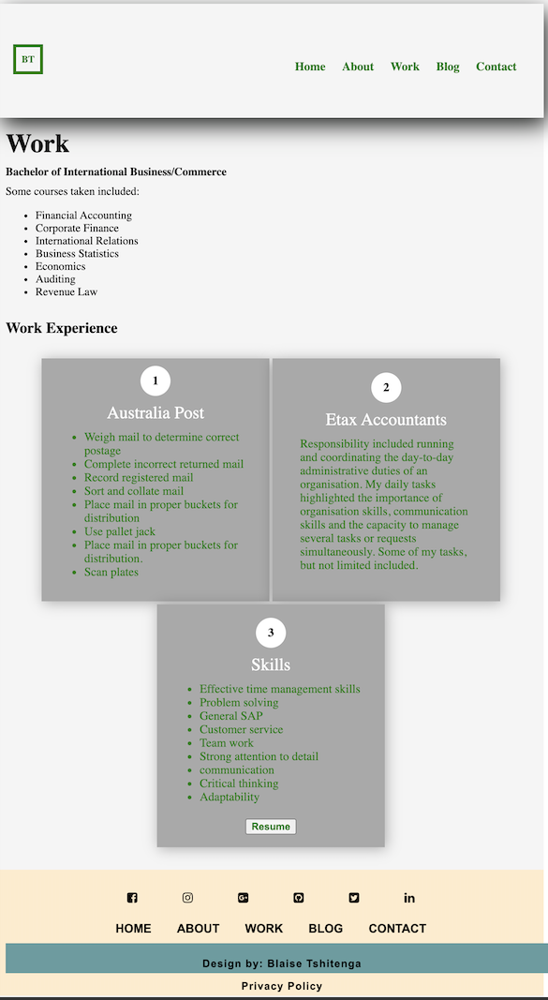  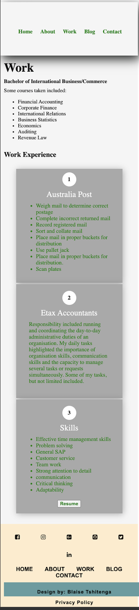

### Blog page
---

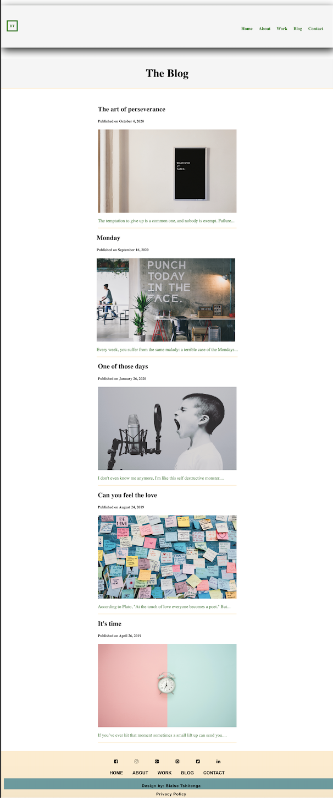  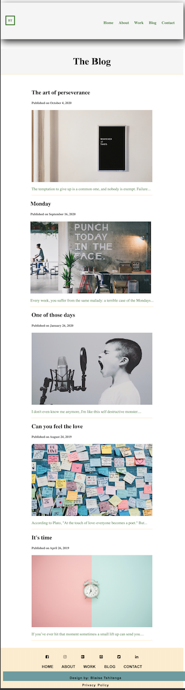  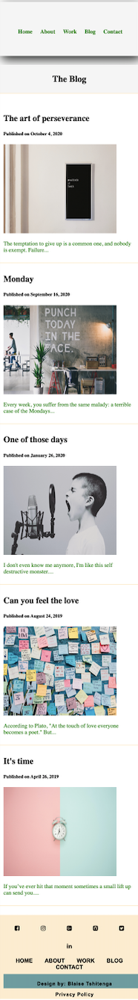

### Contact page
---

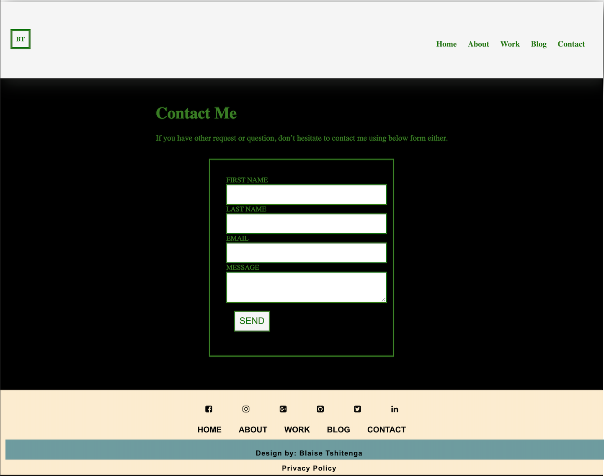  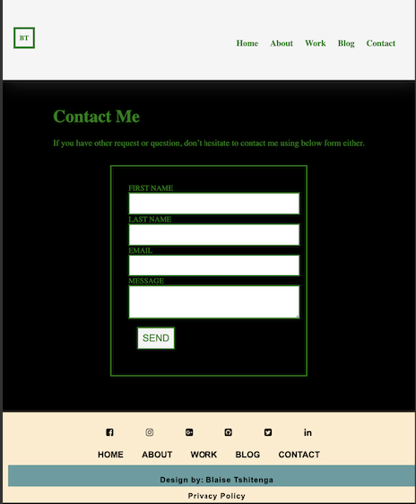  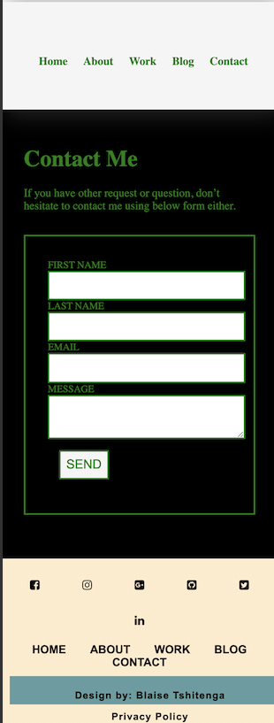

> ## Target audience
Coder Academy is looking to engage a dev and/or IT professional 12 months.

### Role
The digital team within at Coder Academy is seeking a dev and/or IT professional to assist with the increase in demand. 
You will be engaged on a contractual basis for 12 months to assist in the design, development and deployment of a number of project, dealing with internal and external stakeholders to implement new user-friendly systems.

As a result, the job requires a mix of business and technical knowledge, as well as excellent interpersonal skills.

Key skills include:

- Technical knowledge relating to information technology, 
- Software development/coding, programming languages and development stacks
- High expectations of professionalism and a positive work ethic

> ## Tech stack
- HTML5
- SASS & CSS 
- BALSAMIQ
- VISUAL STUDIO CODE
